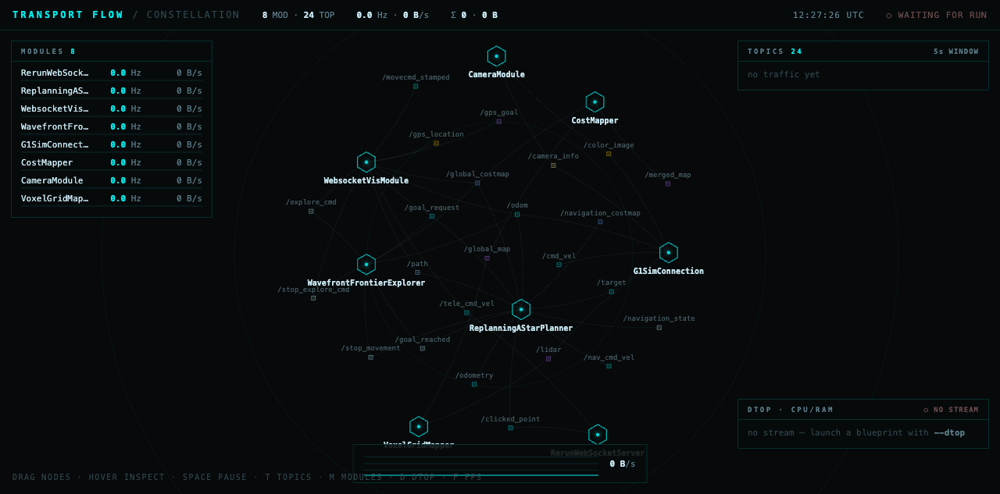
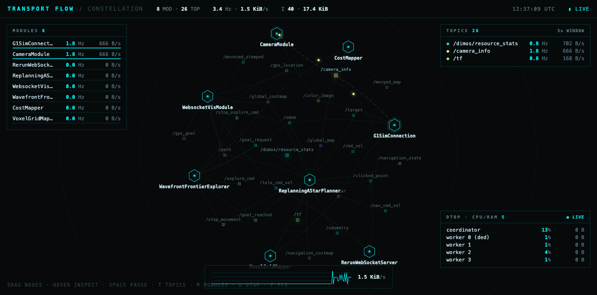

# dim-lcm-constellation

A [DimOS dashboard](https://github.com/jeff-hykin/dim-app) app that visualizes
**live LCM traffic** as a constellation: modules and topics are nodes, and every
packet on the wire lights up the edge it travelled along.

- **Constellation** — the module↔topic topology recovered from the newest DimOS
  run log, drawn as a graph. Live packets spawn particles that flow along each
  edge, so you can see at a glance which channels are hot.
- **dtop** — per-worker resource stats (folded in from the old `lcm_spy` app),
  decoded straight from the `/dimos/resource_stats` LCM channel.

| Constellation | Live traffic |
| --- | --- |
|  |  |

## How it works

The backend (`main.js`) runs inside the Deno desktop process and subscribes to
**every** LCM channel via a vendored `@dimos/lcm`. It reads *metadata only*
(`{channel, count, bytes}`, batched every 50 ms) — payloads are never decoded —
and forwards those frames to the browser over the app-bus. The module↔topic
topology is parsed from the newest run log's structured `Transport` events and
rescanned periodically, so the graph follows whatever blueprint is running.

> The vendored `lcm_vendor/` is `@dimos/lcm@0.2.0` with a local fix: upstream
> never joins the multicast group, so its receive path saw zero packets. Swap
> back to the jsr import once the fix lands upstream.

## Install

```sh
dim install https://github.com/jeff-hykin/dim-lcm-constellation
```

The app appears in the dashboard rail within a few seconds.

## Layout

```
dim/apps/lcmflow/
  app.yaml        title
  frontend/
    icon.svg      rail icon
    index.html    the constellation view (frontend)
  main.js         backend — LCM sniff + topology, relayed over the app-bus
  lcm_vendor/     vendored @dimos/lcm (multicast-join fix)
```

Licensed under Apache-2.0.
