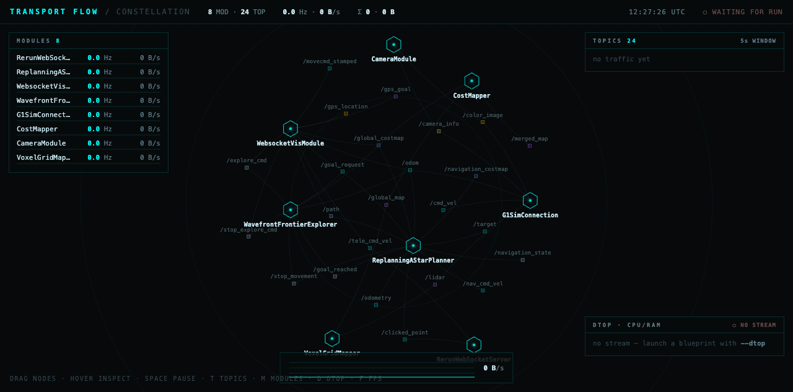
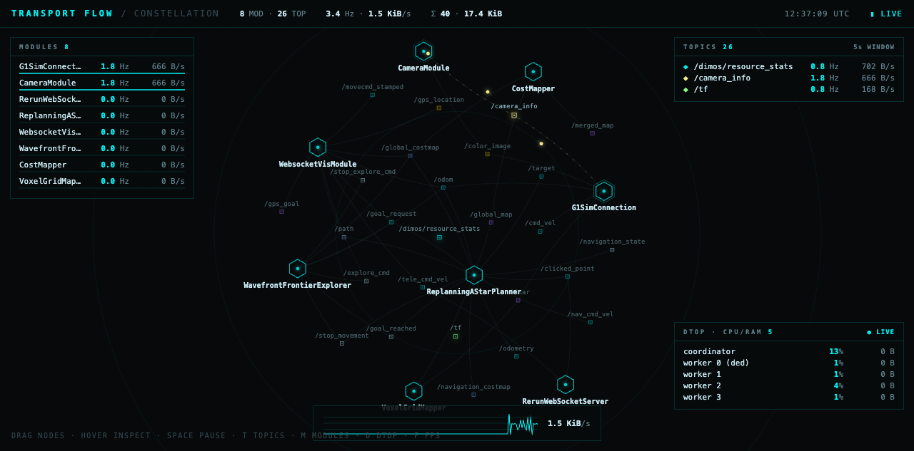

# Constellation

A [dimOS Desktop](https://github.com/dimensionalOS/dimos-desktop) app that shows **live multicast and Zenoh traffic**
over the running blueprint's module graph: modules and topics are nodes, each topic shows its live rate, and every
packet lights up the edges it travelled along. A topics table gives each channel's rate and bandwidth, and a workers
panel shows dtop's per-worker CPU/RAM (from `/resource_stats`, for blueprints run with `--dtop`).

| Constellation                                         | Live traffic                       |
| ----------------------------------------------------- | ---------------------------------- |
|  |  |

## How it works

- `spy/` (Rust) passively sniffs dimos's UDP multicast (239.255.76.67:7667) and Zenoh (a peer `**` subscriber) and
  prints NDJSON metadata (channel, count, bytes) every 50 ms; payloads are never decoded, except `/resource_stats` and a
  `sample <channel>` asked for on stdin.
- `backend/` (Deno) runs the spy, keeps every channel's 5 s rate, sizes and 60 s history, reads the running blueprint
  from Desktop (`/dimos/runs`, `/dimos/blueprints/<name>`), and serves it all as HTTP endpoints (`backend/routes.ts`),
  which `dimos.yaml`'s `agent:` lists, so Desktop's agent can call everything the page does. Pages follow changes over
  zenoh (Desktop's docs/events.md): the backend publishes through Desktop's relay on its frontend topics `events`
  (graph, settings, paused, reset, workers, view-request; ordered), `stats` (2/s) and `packets` (20/s), the last two
  only while a page says it's open (`POST api/pages/<id>` every 10 s); a page answers a view-request with
  `POST api/views/<id>`.
- `frontend/` (TypeScript, Vite, React) draws the graph (DOM nodes + an SVG edge layer, force or Graphviz layouts).

Endpoints include `GET api/topics` (rate, bandwidth, message size, last seen, publishers/subscribers per channel),
`GET api/topic`, `POST api/topic/sample`, `GET api/graph`, `GET api/graph/blueprint` (any blueprint, from its wiring),
`GET api/workers`, `POST api/pause|resume|reset`, `POST api/settings` (layout, table sort/filter, panels, pinned module
card), `GET api/view` (the graph as a PNG).

Desktop's blueprint Details embeds the page as its module graph with `?embed&blueprint=<name>`: no header readouts,
topics table, legend or help text, the layouts and a workers toggle (hidden by default) at the bottom right, and that
blueprint drawn from its wiring when it isn't the one running. A module click is posted to Desktop
(`{type: "constellation:module", module}`), and Desktop lights a module or topic with
`{type: "constellation:focus", module?, topic?}` once the page says `{type: "constellation:ready"}`.

## Install

```sh
dimos-desktop install https://github.com/jeff-hykin/dim-lcm-constellation
```

Desktop builds it with `nix build .#dimosApp`, which compiles the spy and the frontend.

## Develop

```sh
(cd spy && cargo build --release)       # the backend finds spy/target/release/spy
(cd frontend && npm install && npm run build)
deno task dev                           # http://localhost:8787 (vite dev: cd frontend && npm run dev)
deno task test && deno task check       # check also verifies dimos.yaml lists every endpoint
```

The `release` workflow also publishes prebuilt `spy-<platform>` binaries (used by `dtk constellation`).

Licensed under Apache-2.0.
